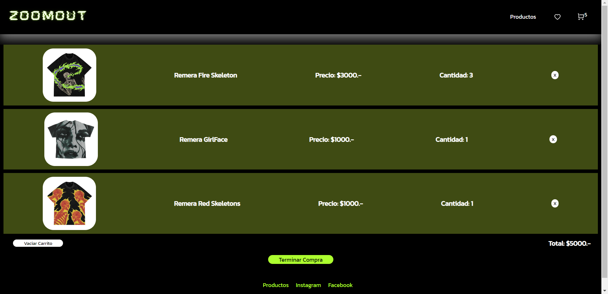

## Ecommerce Zoomout
##### Proyecto final curso de React JS 
___
### Descripción:
Tienda virtual de ropa ficticia que simula la actividad de compra de artículos de indumentaria, construída a partir de React JS + Librerías.
___

## Capturas del proyecto:



___
## Instalacion y configuración:
(Previamente es necesario tener __node y npm__ instalados globalmente en el equipo).

- Clonar el repositorio
```
git clone https://github.com/ambargorgon/ropa-gorgon.git
```


### ``` En terminal:```

- Instalar el entorno:

```
npm install
```

- Iniciar el servidor:

```
npm start
```

Abrir [http://localhost:3000](http://localhost:3000) para ver la aplicación en el navegador.
___

## Librerías utilizadas:

- [React Router Dom "^6.3.0"](https://reactrouter.com/en/main) : Permite implementar enrutamiento dinámico en una aplicación web.
- [React Icons "^4.4.0"](https://react-icons.github.io/react-icons) : Permite incluir íconos en proyectos de React utilizando importaciones de ES6.
- [Firebase / Firestore "^9.10.0"](https://firebase.google.com/docs) : Permite almacenar y conectar la aplicación a una base de datos NoSQL alojada en la nube. 

### Instalación de librerías:
```
npm install nombre-de-libreria
```
___